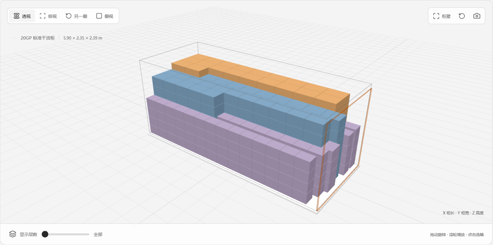

# 柜算 LOADPLAN｜免费开源的装柜计算工具

**这一批货，一个柜能装下吗？怎么摆？还有多少没装进去？**

柜算是一款面向外贸业务员、跟单员、工厂和仓库人员的免费集装箱装柜计算工具。填写货物的外包装尺寸、数量和重量，就能估算装柜数量，查看柜内摆放图，并导出 Excel 或 PDF 报告，方便与同事、客户和仓库沟通。

**[直接在线使用](https://loadplan-fleix.vercel.app) · [下载 Windows / Mac 单机版](https://loadplan-fleix.vercel.app/downloads.html)**

无需注册。打开网页即可使用，也可以下载到电脑，断网时照常计算。

## 能帮你做什么

| 你想知道的事 | 在柜算里可以这样做 |
| --- | --- |
| 20 尺柜、40 尺柜或高柜能装多少货？ | 选择 20GP、40GP 或 40HQ，填写货物后试算。 |
| 多种规格的纸箱放在一起，能不能装下？ | 添加不同产品，查看每种货物已装和未装的数量。 |
| 有没有能多装一些的摆法？ | 比较两种装柜方案，查看数量和摆放图后选择。 |
| 货物在柜里怎么摆？ | 旋转、放大 3D 图，切换俯视或侧视，也能逐层查看。 |
| 有些货不能叠、不能侧放，怎么办？ | 设置摆放方向、是否允许叠放、最多层数、只能放底层等条件。 |
| 怎么把装柜结果发给仓库或客户？ | 导出 Excel 或 PDF，把数量、重量、摆放图和明细一起发出去。 |

*示例装柜图，使用模拟货物。不同颜色对应不同产品，橙色边框表示柜门。*

## 第一次使用，按这四步来

### 1. 选择集装箱

选择 **20GP 标准柜、40GP 标准柜或 40HQ 高柜**。

页面会填入参考尺寸和载重。拿到实际柜子的数据后，可以直接修改柜内长、宽、高、最大载重和柜门尺寸。

### 2. 填写货物清单

每种规格填一项：

- **产品名称**：点击名称或旁边的铅笔即可修改。
- **长、宽、高**：填写装柜时的外包装尺寸，单位是毫米（mm）。例如 60 × 40 × 40 厘米的纸箱，填写 **600 × 400 × 400**。
- **数量**：填写这次准备装柜的箱数或托数。
- **毛重**：填写每箱或每托连同包装的总重量，单位是千克（kg）。
- **摆放要求**：按实际情况设置能否转向、能否叠放、最多几层，以及是否只能放底层。

有多种产品，点击 **“添加货物规格”** 继续填写。没有整理好数据，也可以先用页面自带的样例熟悉操作。

### 3. 计算并查看摆放图

点击 **“计算装柜方案”**，查看已装数量、未装数量、已装毛重，以及用了多少柜内空间。

在 **“比较装柜方案”** 中点击 **“重新比较”**，可以查看另一种摆法。选择要查看的方案后，下面的 3D 图和货物明细会一起更新。

拖动图片可以转动视角，滚轮可以放大、缩小；也可以从上面、侧面查看，或逐层检查货物位置。

### 4. 导出结果，发给需要的人

- **导出 Excel**：装载概况、3D 图和货物明细放在同一个工作表里，方便查看、编辑和打印。
- **导出 PDF**：生成排版好的装柜报告，方便转发和打印。
- **单独保存图片**：点击 3D 图右上角的相机按钮。

报告使用你当前选中的方案。导出的 3D 图保留当前查看角度，并显示全部货物层。

**修改货物后，请重新计算再导出。关闭或刷新页面前，请先导出需要保留的报告。**

## 纸箱、整托和其他货物怎么填

| 装柜时是什么样子 | 应该填写什么 |
| --- | --- |
| 纸箱、木箱 | 外包装的最大长、宽、高，以及每箱毛重。 |
| 整托货物 | 装载单位选择“整托”，填写托盘连同货物的整体尺寸、整托总重量和托数。 |
| 木架包装、裸装机器 | 填写能完整包住货物的最大长、宽、高，并设置是否允许叠放。木架内部的空隙不用于放入其他货物。 |
| 桶、卷材等圆柱货物 | 选择直立或横放。横放时，整体尺寸和重量要包含防滚支架；当前横放圆柱只放底层、不叠放。 |

例如：**花瓶装在纸箱里，就按纸箱外尺寸计算，不需要填写花瓶本身的形状。**

## 选择网页版，还是下载到电脑

| 使用方式 | 适合什么情况 |
| --- | --- |
| [在线网页版](https://loadplan-fleix.vercel.app) | 临时试算、第一次体验，不想安装软件。 |
| [Windows 单机版](https://loadplan-fleix.vercel.app/downloads.html) | 常见 Intel / AMD 电脑，64 位 Windows 10 或 11。 |
| [Mac Apple 芯片版](https://loadplan-fleix.vercel.app/downloads.html) | M 系列芯片的 Mac，macOS 12 或更新版本。 |
| [Mac Intel 芯片版](https://loadplan-fleix.vercel.app/downloads.html) | Intel 芯片的 Mac，macOS 12 或更新版本。 |

网页版和单机版都可以进行装柜计算、查看 3D 图和导出报告。**单机版安装完成后，无需联网使用。**

Mac 用户可以在苹果菜单的“关于本机”中查看芯片类型。首次安装遇到系统提示，请参阅[下载页面的安装说明](https://github.com/fleixweb/Loadplan/releases/latest)。

## 常见问题

**使用要收费吗？需要账号吗？**

不收费，也不需要注册账号。外贸公司、工厂和仓库都可以用它处理自己的装柜工作。

**产品清单会上传吗？**

货物数据和装柜计算在你自己的浏览器或电脑中处理，默认不上传业务数据。

**能直接导入我现有的产品 Excel 吗？**

目前不支持，需要在页面填写货物。导出的 Excel 和 PDF 是结果报告，不能导回工具继续编辑。

**可以一次算多少货？**

目前一次计算一个集装箱，最多填写 30 种规格、合计 1,500 件货物。需要多个柜时，可分柜试算。

**显示没装进去，就一定装不下吗？**

不一定。可以比较另一种方案，也可以核实摆放要求后重新试算。柜算目前不会把不同规格的货物互相叠放，现场可能存在其他摆法。

**能直接照着图安排装柜吗？**

摆放图适合用于装柜前的数量估算和沟通。实际装柜还需要核实包装承重、搬运空间、绑扎固定和运输要求。逐层查看不等于实际装货顺序。

**报告里能复制或修改文字吗？**

Excel 的明细可以编辑。当前 PDF 主要用于查看和打印，其中的文字不能直接选中复制。

## 联系作者

由 **Fleix** 开发维护。如果你在实际装柜中遇到问题，或有希望增加的功能，欢迎通过 [GitHub 反馈](https://github.com/fleixweb/Loadplan/issues) 或邮件联系：**[45186482@qq.com](mailto:45186482@qq.com)**。

反馈时可以说明柜型、货物外尺寸、数量和希望的摆法；请勿附带客户等敏感信息。

## 开源与二次开发

柜算使用 [AGPL-3.0 开源协议](LICENSE)，并附有[作者署名和修改版标识要求](ADDITIONAL_TERMS.md)。如果你只是用来计算装柜，直接打开工具即可；如果要修改或发布软件，请先阅读完整条款。

开发与部署说明见[发布文档](docs/distribution.md)，第三方组件声明见[许可说明](public/third-party-notices.txt)。

© 2026 Fleix · 柜算 LOADPLAN · 免费开源的装柜计算工具
